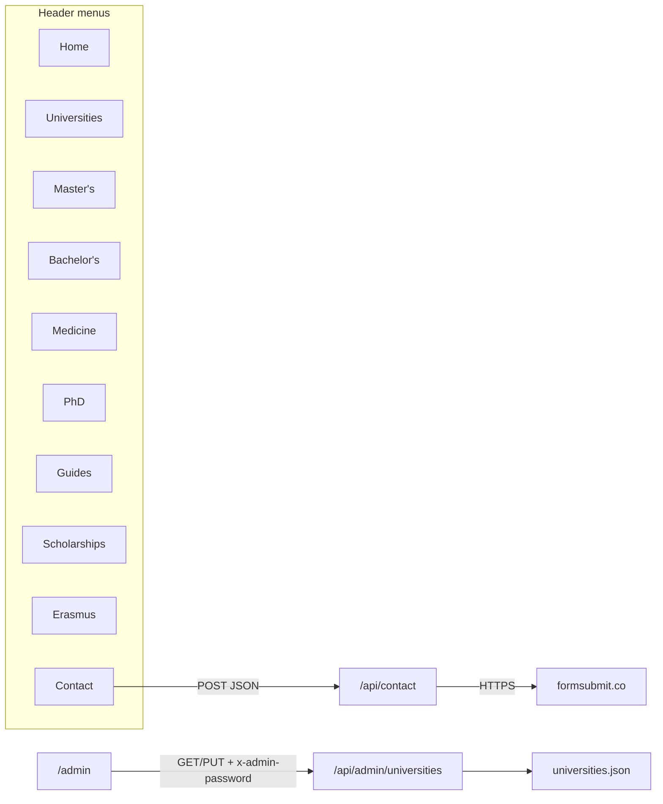

# KS Abroad Studies — API map (menu-wise)

Two kinds of “API” exist on this site:

1. **HTTP APIs** — Next.js route handlers under `/api/*` (only three operations).
2. **Server data loaders** — `src/lib/*` functions that pages call with `await` (no public URL). These are listed under each menu because that is how every page gets data.

Related: [architecture](./architecture.md) · [sitemap](./sitemap.md) · [erd](./erd.md)



---

## 0. HTTP APIs at a glance

| Method | Path | Auth | Rate limit | Used by menu |
| --- | --- | --- | --- | --- |
| `POST` | `/api/contact` | none (honeypot) | 5 / IP / 60s | Contact |
| `GET` | `/api/admin/universities` | header `x-admin-password` | 20 / IP / 60s | Admin (not in header) |
| `PUT` | `/api/admin/universities` | same | 20 / IP / 60s | Admin |

All `/api/*` responses: `Cache-Control: no-store`.  
`robots.txt` disallows `/api/`.

There is **no** public REST for universities, programmes, PhD, scholarships, or guides. Those are SSR JSON reads.

---

## 1. Home — `/`

**HTTP APIs:** none.

| Loader | File | What the page uses |
| --- | --- | --- |
| `getMeta()` | `universities.json` | intake, lastUpdated, university/programme counts, open/soon/closed counts, Universitaly deadline |
| `SITE` | `site.ts` | name, tagline, WhatsApp, logo |

Client fetch: none.

---

## 2. Universities — `/universities` and `/universities/[id]`

**HTTP APIs:** none on public pages.

| Loader | File | Use |
| --- | --- | --- |
| `getUniversities()` | `universities.json` | sorted list for explorer |
| `getUniversity(id)` | same | detail page |
| `getMeta()` | same | intake / deadline chrome |
| `generateStaticParams` | same | prebuild `[id]` list |

**Admin write path for this menu’s data** (not linked in the header): see [section 11](#11-admin--admin--not-in-public-menu).

Explorer filters run in the browser on the already-loaded array (`university-explorer.tsx`). No extra API.

---

## 3. Master's — `/programs/master`

**HTTP APIs:** none.

| Loader | File | Use |
| --- | --- | --- |
| `getPrograms("master")` | `universities.json` → `programs[]` where `level = master` | explorer rows (name, field, applyUrl, universityId, city) |
| `getMeta()` | same | counts / intake |

`english-masters.json` is **not** called.

---

## 4. Bachelor's — `/programs/bachelor`

**HTTP APIs:** none.

| Loader | File | Use |
| --- | --- | --- |
| `getPrograms("bachelor")` | `universities.json` | explorer |
| `getCentSGuide()` | `cent-s-guide.json` | CISIA CEnT-S guide block |
| `getMeta()` | `universities.json` | counts |

`english-bachelors.json` is **not** called.

---

## 5. Medicine — `/programs/single-cycle`

**HTTP APIs:** none.

| Loader | File | Use |
| --- | --- | --- |
| `getPrograms("single-cycle")` | `universities.json` | MBBS / dentistry / veterinary / pharmacy list |
| `getImatInfo()` | `english-single-cycle.json` → `imat` | IMAT explanation, portal, documents |
| `getMeta()` | `universities.json` | counts |

---

## 6. PhD — `/phd` and `/phd/[id]`

**HTTP APIs:** none.

| Loader | File | Use |
| --- | --- | --- |
| `getPhdDataset()` | `phd.json` | A–Z guide, cycle XLII, counts |
| `getPhdUniversities()` | same | explorer |
| `getPhdUniversity(id)` | same | detail |
| `generateStaticParams` | same | `[id]` |

Research files `phd-research-*.json` are **not** called.

Off-site links (not our APIs): `pica.cineca.it`, university PhD hubs.

---

## 7. Guides — `/guides` and children

**HTTP APIs:** none.

| Menu / URL | Loader | File |
| --- | --- | --- |
| `/guides` hub | `getPakistanGuides()` | `pakistan-guides.json` |
| `/guides/documents` | `getPakistanGuides()` | documentChain, apostille |
| `/guides/translations` | `getTranslationGuide()` | `translation-companies.json` |
| `/guides/motivation-letter` | `getPakistanGuides()` | motivationLetter |
| `/guides/dov` | `getPakistanGuides()` | dovChecklist, postAdmission, CIMEA links |
| `/guides/visa` | `getPakistanGuides()` | islamabadVisaChecklist, karachiVisaInfo, Universitaly deadline |
| `/guides/scholarship-docs` | `getPakistanGuides()` + `getScholarshipRegions()` + `getScholarshipsDataset()` | Pakistan DSU steps **and** per-region lists |

External links from guides (not our APIs): CIMEA, Universitaly, embassy PDFs if `href` is off-site.

---

## 8. Scholarships — `/scholarships` and `/scholarships/[id]`

**HTTP APIs:** none.

| Loader | File | Use |
| --- | --- | --- |
| `getScholarshipsDataset()` | `regional-scholarships.json` | national DSU notes |
| `getScholarshipRegions()` | same | list |
| `getScholarshipRegion(id)` | same | detail |
| `generateStaticParams` | same | `[id]` |

Off-site: each region’s `portalUrl` / `applyUrl` (e.g. Lazio DiSCo).

---

## 9. Erasmus — `/erasmus`

**HTTP APIs:** none.

| Loader | File | Use |
| --- | --- | --- |
| `getErasmusGuide()` | `erasmus.json` | 2027 cycle, timeline, scholarship, documents, downloads |

Off-site: official Erasmus Mundus catalogue / EC pages stored as URLs in that JSON.

---

## 10. Contact — `/contact`  (only public HTTP API)

### `POST /api/contact`

**Caller:** `contact-form.tsx` (`fetch("/api/contact")`).

**Request headers**

- `Content-Type: application/json`
- `Accept: application/json`

**JSON body**

| Field | Required | Max | Notes |
| --- | --- | --- | --- |
| name | yes | 80 | |
| email | yes | 120 | must look like an email |
| phone | no | 30 | WhatsApp number |
| purpose | yes | 80 | see enum below |
| message | yes | 2000 | |
| website | no | 200 | **honeypot** — leave empty |

**Purpose values (form `<select>`)**

- University shortlisting
- Bachelor / CEnT-S guidance
- Master application
- Medicine / IMAT
- Scholarship guidance
- Visa / Universitaly
- B2B / agency collaboration

**Responses**

| Status | Body |
| --- | --- |
| 200 | `{ ok: true }` |
| 200 | `{ ok: true }` if honeypot filled (no email sent) |
| 400 | `{ ok: false, error: "Please fill name, email, purpose, and message." }` |
| 400 | `{ ok: false, error: "Enter a valid email address." }` |
| 429 | `{ ok: false, error: "Too many messages. Please wait a minute." }` |
| 502 | `{ ok: false, error: "Email service unavailable…" }` |
| 500 | `{ ok: false, error: "Unexpected error. Please WhatsApp." }` |

**Downstream API (server-only)**

`POST https://formsubmit.co/ajax/{encodeURIComponent(to)}`

| FormSubmit field | Value |
| --- | --- |
| name, email, phone, purpose | from body |
| `_replyto` | student email |
| message | formatted text block |
| `_subject` | `KS Abroad inquiry · {purpose} · {name}` |
| `_template` | `table` |
| `_captcha` | `false` |

`to` = `process.env.CONTACT_TO_EMAIL` or `ksabroadstudies@gmail.com`.  
CSP `connect-src` allows `https://formsubmit.co`.

**Also on this menu (not HTTP):** `SITE.whatsappUrl`, `SITE.emailUrl`.

---

## 11. Admin — `/admin`  (not in public menu)

Staff-only seasonal editor for the **Universities** catalogue.

### `GET /api/admin/universities`

| Header | Value |
| --- | --- |
| `x-admin-password` | must match `ADMIN_PASSWORD` |

**200:** full `UniversitiesDataset` JSON.  
**401:** `{ error: "Unauthorized" }`  
**429:** `{ error: "Too many requests" }`

### `PUT /api/admin/universities`

Same auth header.

**JSON body (all except `id` optional)**

```json
{
  "id": "roma-tre",
  "status": "open",
  "estimatedOpenDate": "2027-03-01",
  "deadline": "2027-04-15",
  "applicationFeeEuro": 30,
  "notes": "string, max 4000"
}
```

`status` ∈ `open` | `soon` | `closed` | `tba`.

**200:** `{ ok: true, university: { ...updated row } }`  
**400:** missing id / invalid JSON  
**401 / 429:** as GET  
**404:** `{ error: "University not found" }`

**Side effect:** overwrites `src/data/universities.json` and sets `lastUpdated` to today’s ISO date. On a read-only host (typical serverless) this write will fail — admin is designed for a Node server with a writable disk.

Password is remembered in the browser: `localStorage["ks-admin-password"]`.

---

## 12. Footer-only pages (same loader style)

| URL | Loaders | HTTP API |
| --- | --- | --- |
| `/study-in-italy` | `getMeta()` | none |
| `/programs` | `getMeta()` | none |
| `/process` | `getMeta()`, `getCentSGuide()`, `getImatInfo()` | none |
| `/about` | `getCompanyProfile()`, `SITE` | none |
| `/agreement` | `SITE` only | none |

---

## 13. Cross-cutting / infrastructure

| Surface | Behaviour |
| --- | --- |
| `middleware.ts` | noindex `/admin` and `/api/admin`; 404 on probe paths |
| `GET` static files | `/ks-abroad-logo.png`, `/company/*.pdf`, `/robots.txt` |
| `/sitemap.xml` | advertised in robots.txt, **route not implemented** |
| Google Fonts | loaded by `next/font` (Fraunces, Manrope) |

---

## 14. Menu → API cheat sheet

| Menu | Public HTTP | Server loaders | External HTTP |
| --- | --- | --- | --- |
| Home | — | `getMeta` | — |
| Universities | — | `getUniversities` / `getUniversity` | university portals (links) |
| Master's | — | `getPrograms("master")` | programme URLs |
| Bachelor's | — | `getPrograms("bachelor")` + `getCentSGuide` | CISIA (link) |
| Medicine | — | `getPrograms("single-cycle")` + `getImatInfo` | Universitaly / IMAT (links) |
| PhD | — | `getPhd*` | PICA / uni PhD portals (links) |
| Guides | — | `getPakistanGuides` / `getTranslationGuide` / scholarships | CIMEA, embassy (links) |
| Scholarships | — | `getScholarship*` | DSU agency sites (links) |
| Erasmus | — | `getErasmusGuide` | EC catalogue (links) |
| Contact | **POST `/api/contact`** | `SITE` | **FormSubmit**, WhatsApp |
| Admin | **GET/PUT `/api/admin/universities`** | `getDataset` / `saveDataset` | — |
