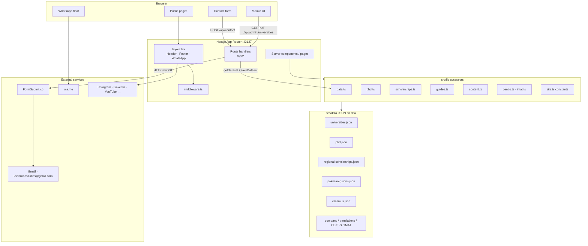

# KS Abroad Studies — Website Architecture

**Product:** Informative Study in Italy website for KS Abroad Studies (Private) Limited (SECP CUIN 0241969)  
**Audience:** Pakistani students applying to Italian public universities  
**Stack:** Next.js 16 (App Router) · React 19 · TypeScript · Tailwind CSS 4  
**Runtime data store:** JSON files on disk (`src/data/`) — there is no SQL database  
**Local URL:** `http://localhost:43127`

Related documents:

- [Site map](./sitemap.md)
- [ERD / data model](./erd.md)
- [API map](./api-map.md)

---

## 1. What this system is

The site is a **content-driven consultancy hub**, not a student CRM.

| It does | It does not |
| --- | --- |
| Publish curated university, programme, PhD, scholarship, and visa guidance | Store student applications or accounts |
| Show seasonal admission status (Open / Soon / Closed / TBA) | Talk to Universitaly or university portals as an API client |
| Accept contact inquiries and email them out | Keep an inquiry inbox in its own database |
| Let an admin update university status on disk | Offer public write APIs for catalogues |

---

## 2. High-level architecture



**Request path**

1. Browser hits a URL.
2. `middleware.ts` adds security headers, noindexes `/admin` and `/api/admin`, and 404s probe paths (`.env`, `wp-admin`, phpMyAdmin).
3. `layout.tsx` wraps every page with header, footer, and WhatsApp button.
4. Most pages are **server components**: they `await` a function in `src/lib/*`, which `fs.readFile`s a JSON file.
5. Two pages call **HTTP APIs** from the browser: Contact (`POST /api/contact`) and Admin (`GET`/`PUT /api/admin/universities`).

---

## 3. Folder map

```
ks-abroad-studies/
├── src/app/                 # Routes (pages + API)
│   ├── page.tsx             # Home
│   ├── api/contact/         # Public contact API
│   ├── api/admin/universities/  # Protected admin API
│   ├── universities/        # List + [id]
│   ├── programs/            # Hub + bachelor / master / single-cycle
│   ├── phd/                 # List + [id]
│   ├── scholarships/        # List + [id]
│   ├── guides/              # Hub + 6 guide pages
│   ├── erasmus/ process/ about/ agreement/ contact/ admin/
│   ├── layout.tsx
│   └── globals.css
├── src/components/          # Header, footer, explorers, forms
├── src/lib/                 # Types + JSON loaders
├── src/data/                # Source of truth JSON
├── public/                  # Logo, PDFs, PWA assets
│   ├── manifest.webmanifest
│   └── sw.js
├── src/app/
│   ├── sitemap.ts           # /sitemap.xml
│   ├── robots.ts            # /robots.txt
│   ├── llms.txt/route.ts    # AI short index
│   └── llms-full.txt/route.ts
├── middleware.ts
├── next.config.ts           # Security headers / CSP
└── docs/                    # These architecture documents
```

---

## 4. Layers

### 4.1 Presentation

| Piece | Role |
| --- | --- |
| `SiteHeader` | Primary menu (see [sitemap](./sitemap.md)) |
| `SiteFooter` | Extra Explore links (Process, About, Agreement, DOV, Visa) |
| `WhatsAppFloat` | Persistent chat to `+92 313 1365614` |
| `*-explorer` components | Client-side filter/search on data already loaded by the server |
| Fonts | Fraunces (display) + Manrope (body) via `next/font` |

Pages marked `export const dynamic = "force-dynamic"` always read fresh JSON (universities, programmes hub, university detail).

### 4.2 Domain accessors (`src/lib`)

| Module | Reads | Used by |
| --- | --- | --- |
| `data.ts` | `universities.json` | Home, universities, programmes, process, admin API |
| `phd.ts` | `phd.json` | `/phd`, `/phd/[id]` |
| `scholarships.ts` | `regional-scholarships.json` | Scholarships + scholarship-docs guide |
| `guides.ts` | `pakistan-guides.json` | Guides hub and visa/DOV/documents pages |
| `content.ts` | `erasmus.json`, `translation-companies.json`, `company.json` | Erasmus, translations, About |
| `cent-s.ts` | `cent-s-guide.json` | Bachelor page + process |
| `imat.ts` | `english-single-cycle.json` (IMAT block) | Medicine page + process |
| `site.ts` | In-code constants | Identity, WhatsApp, social URLs |

**Write path (only one):** `saveDataset()` in `data.ts` overwrites `universities.json` when Admin saves status/dates/fee/notes.

### 4.3 Persistence

Logical entities and keys are in [erd.md](./erd.md).

Runtime JSON:

| File | Entity |
| --- | --- |
| `universities.json` | University + nested Program + ApplyLink |
| `phd.json` | PhdGuide + PhdUniversity + PhdProgramme |
| `regional-scholarships.json` | ScholarshipGuide + RegionalScholarship |
| `pakistan-guides.json` | Pakistan desk: documents, DOV, visa, motivation letter |
| `erasmus.json` | Erasmus Mundus 2027 guide |
| `translation-companies.json` | Islamabad + Karachi translator lists |
| `company.json` | SECP company profile + PDF downloads |
| `cent-s-guide.json` | CISIA CEnT-S test guide |
| `english-single-cycle.json` | IMAT guide + single-cycle programme list (IMAT fields used) |

Present on disk but **not imported by the app** (research / archive):

- `english-bachelors.json`
- `english-masters.json`
- `phd-research-centre-north.json`
- `phd-research-lazio-south.json`
- `admission-status-research.json`
- `english-single-cycle-italy-research.json` (repo root)
- `src/data/imat-guide.md`

Live bachelor/master/single-cycle lists on the site come from **`universities.json` → `programs[]`**, not from those extra catalogues.

### 4.4 HTTP edge

Defined in [api-map.md](./api-map.md).

| Route | Methods | Who |
| --- | --- | --- |
| `/api/contact` | `POST` | Public contact form |
| `/api/admin/universities` | `GET`, `PUT` | `/admin` only, header `x-admin-password` |

Outbound:

- `https://formsubmit.co/ajax/{email}` — delivers the contact message
- WhatsApp / social links — ordinary `https://` anchors, not APIs

---

## 5. Security architecture

| Control | Where |
| --- | --- |
| Hardened headers (HSTS, nosniff, COOP, frame, Permissions-Policy, CSP) | `next.config.ts` + `middleware.ts` |
| CSP: no `unsafe-eval` in production; `upgrade-insecure-requests` | `next.config.ts` |
| Edge API rate limits + probe path 404 (`.env`, `.git`, `/data`, WP, etc.) | `src/middleware.ts` + `src/lib/security.ts` |
| CSRF / trusted-origin checks on mutating APIs | `assertTrustedOrigin` |
| Student PII offline under `/data` (gitignored, HTTP blocked) | `students.ts` + middleware |
| Session cookies `httpOnly` + `secure` in production | `src/lib/auth.ts` |
| Password policy (10+ chars, letters + numbers) | register API + form |
| Admin auth | `ADMIN_PASSWORD` + `timingSafeEqual` |
| Notify test | **Always** requires admin password (never open in prod/dev) |
| Optional catalogue lock | `CATALOGUE_API_KEY` → require `x-api-key` on `/api/v1/*` |
| Contact honeypot + rate limit | `api/contact` |
| PDF downloads as attachment + private cache | `/company/*.pdf`, `/guides/*.pdf` headers |
| `/.well-known/security.txt` | disclosure contact |
| Portal/admin `noindex` + `no-store` | middleware + config |

**Honest limit:** HTML/CSS/JS delivered to a browser can always be viewed or saved. Security here focuses on **student data, uploads, admin, abuse, and bulk scraping** — not DRM that pretends a public page cannot be copied.

Contact email: `CONTACT_TO_EMAIL` or fallback `SITE.email` (`ksabroadstudies@gmail.com`).

Production checklist: set strong `ADMIN_PASSWORD`, `SESSION_SECRET`, `PORTAL_JWT_SECRET`, `NEXT_PUBLIC_SITE_URL`; optionally `CATALOGUE_API_KEY` and `TRUSTED_ORIGINS`.

---

## 6. Rendering and identity

| Concern | Choice |
| --- | --- |
| Rendering | App Router server components; explorers are `"use client"` for filters |
| Dynamic routes | `/universities/[id]`, `/phd/[id]`, `/scholarships/[id]` (`generateStaticParams` + `force-dynamic` on university routes) |
| Company identity | `src/lib/site.ts` + `src/data/company.json` |
| Logo | `/public/ks-abroad-logo.png` |
| Legal PDFs | `/public/company/*.pdf` |

AI/SEO surfaces are implemented (`sitemap.ts`, `robots.ts`, `llms.txt`, JSON-LD). Set `NEXT_PUBLIC_SITE_URL` in production for absolute canonical URLs.

---

## 7. Menu → data (summary)

Full API list: [api-map.md](./api-map.md).

| Header item | Primary JSON / API |
| --- | --- |
| Home `/` | `universities.json` (counts only) |
| Universities | `universities.json` |
| Master's / Bachelor's / Medicine | `universities.json` programmes + CEnT-S / IMAT JSON |
| PhD | `phd.json` |
| Guides | `pakistan-guides.json` + translations JSON |
| Scholarships | `regional-scholarships.json` |
| Erasmus | `erasmus.json` |
| Contact | `POST /api/contact` → FormSubmit |

---

## 8. Runtime

```bash
npm install
npm run dev    # next dev --hostname 0.0.0.0 --port 43127
npm run build
npm start      # same host/port
```

Admin: open `/admin`, send `ADMIN_PASSWORD` via header (the page stores it in `localStorage` key `ks-admin-password`).
