# KS Abroad Studies — ERD (data model)

There is **no relational database**. This is the **logical entity-relationship model** of the JSON files and TypeScript types the site actually uses.

Physical store: `src/data/*.json` plus constants in `src/lib/site.ts`.  
Contact inquiries are **not persisted**; they are emailed via FormSubmit.

Related: [architecture](./architecture.md) · [API map](./api-map.md)

---

## 1. Entity-relationship diagram

```mermaid
erDiagram
  SITE_CONFIG ||--o{ SOCIAL_LINK : "has"
  COMPANY_PROFILE ||--o{ COMPANY_DOWNLOAD : "has"

  UNIVERSITIES_DATASET ||--|{ UNIVERSITY : "contains"
  UNIVERSITY ||--o{ PROGRAM : "offers"
  UNIVERSITY ||--o{ APPLY_LINK : "lists"
  UNIVERSITY }o--|| ITALY_REGION : "region"

  PHD_DATASET ||--|| PHD_GUIDE : "includes"
  PHD_DATASET ||--|{ PHD_UNIVERSITY : "contains"
  PHD_UNIVERSITY ||--o{ PHD_PROGRAMME : "lists"
  PHD_UNIVERSITY }o--o| UNIVERSITY : "same Italy uni optional, different id space"

  SCHOLARSHIPS_DATASET ||--|| SCHOLARSHIP_GUIDE : "includes"
  SCHOLARSHIPS_DATASET ||--|{ REGIONAL_SCHOLARSHIP : "contains"
  REGIONAL_SCHOLARSHIP ||--o{ SCHOLARSHIP_AGENCY : "may have"
  REGIONAL_SCHOLARSHIP }o--o| UNIVERSITY : "same geographic region"

  PAKISTAN_GUIDES ||--o{ GUIDE_STEP : "documentChain / scholarship / motivation"
  PAKISTAN_GUIDES ||--o{ GUIDE_DOWNLOAD : "has"

  TRANSLATION_GUIDE ||--|| TRANSLATION_REGION : "islamabad"
  TRANSLATION_GUIDE ||--|| TRANSLATION_REGION : "karachi"
  TRANSLATION_REGION ||--|{ TRANSLATION_COMPANY : "lists"

  ERASMUS_GUIDE ||--o{ ERASMUS_DOWNLOAD : "has"
  ERASMUS_GUIDE ||--o{ ERASMUS_TIMELINE : "has"

  SINGLE_CYCLE_DATASET ||--|| IMAT_INFO : "includes"
  SINGLE_CYCLE_DATASET ||--o{ SINGLE_CYCLE_PROGRAM : "lists"
  SINGLE_CYCLE_PROGRAM }o--o| UNIVERSITY : "universityId"

  CENTS_GUIDE ||--|{ CENTS_SECTION : "structure"

  CONTACT_INQUIRY }o--|| SITE_CONFIG : "mailed to SITE.email"
  ADMIN_UPDATE }o--|| UNIVERSITY : "writes status fields"
```

---

## 2. Catalogue split (read this first)

| Catalogue | File | Meaning of “university” |
| --- | --- | --- |
| Admissions | `universities.json` | Degree-seeking bachelor / master / single-cycle calls + status |
| PhD | `phd.json` | Dottorato schools / portals (PICA, Esse3, own) |
| Scholarships | `regional-scholarships.json` | DSU **region / agency**, not a university row |
| Programmes on the UI | nested `University.programs` | Live lists for Master / Bachelor / Medicine pages |

`english-bachelors.json` and `english-masters.json` look like programme tables (`universityId`, `name`, `field`, `applyUrl`) but **are not loaded by the running app**.

---

## 3. Entity dictionary

### 3.1 `SITE_CONFIG` — `src/lib/site.ts` (not JSON)

| Field | Type | Notes |
| --- | --- | --- |
| legalName | string | KS Abroad Studies (Private) Limited |
| cuin | string | 0241969 |
| name | string | KS Abroad Studies |
| tagline | string | Book your Career, Fly into the Future |
| founder | string | Faizan Ali Qureshi |
| founderHandle | string | @Faqineurope |
| whatsappE164 | string | 923131365614 |
| whatsappDisplay | string | +92 313 1365614 |
| whatsappUrl | string | wa.me link |
| whatsappChannelUrl | string | WhatsApp channel |
| email | string | ksabroadstudies@gmail.com |
| logoSrc | string | `/ks-abroad-logo.png` |
| social URLs | string | Instagram, LinkedIn, TikTok, YouTube, Threads, Facebook, Linktree |

**PK:** none (singleton).

### 3.2 `SOCIAL_LINK`

| Field | Type |
| --- | --- |
| id | string (PK in list) |
| label | string |
| href | string |
| group | `company` \| `founder` \| `channels` |

### 3.3 `COMPANY_PROFILE` — `company.json`

| Field | Type |
| --- | --- |
| lastUpdated | date string |
| legalName | string |
| cuin | string |
| incorporatedOn | date |
| incorporatedOnLabel | string |
| registeredOffice | string |
| registrar | string |
| act | string |
| processId | string |
| filingAckNumber | string |
| filingAckDate | string |
| verifyUrl | string (SECP eServices) |
| disclaimer | string |
| downloads[] | `{ label, href }` PDFs under `/company/` |

**PK:** `cuin`.

### 3.4 `UNIVERSITIES_DATASET` — `universities.json`

| Field | Type |
| --- | --- |
| intake | string | e.g. 2026/27–2027/28 |
| lastUpdated | date |
| sourceNote | string |
| universitalyPreEnrolmentDeadline | date | default 2026-11-30 |
| universities[] | University |

**PK:** singleton file.

### 3.5 `UNIVERSITY`

| Field | Type | Notes |
| --- | --- | --- |
| id | string | **PK** slug |
| name | string | |
| city | string | |
| region | `lazio` \| `south` \| `centre` \| `north` | |
| priority | number | sort key (lower first) |
| website | url | |
| admissionPortal | url | |
| applicationFeeEuro | number \| null | |
| englishRequirement | string | |
| cgpaRequirement | string | |
| requiresCimea | boolean | |
| status | `open` \| `soon` \| `closed` \| `tba` | **admin-writable** |
| estimatedOpenDate | string \| null | **admin-writable** |
| deadline | string \| null | **admin-writable** |
| notes | string | **admin-writable** (max 4000 on save) |
| applyLinks[] | ApplyLink | |
| programs[] | Program | |

### 3.6 `APPLY_LINK`

| Field | Type |
| --- | --- |
| label | string |
| url | string |
| type | `portal` \| `tutorial` \| `universitaly` |

No own PK. Weak entity of University.

### 3.7 `PROGRAM`

| Field | Type |
| --- | --- |
| name | string |
| level | `bachelor` \| `master` \| `single-cycle` |
| applyUrl | string \| null |
| field | string |
| admissionTest | string \| null | e.g. CEnT-S, IMAT, TIL-I |

**Logical PK:** (`university.id`, `name`, `level`). Nested, not a separate file.

### 3.8 `PHD_DATASET` / `PHD_GUIDE` — `phd.json`

**PhdDataset:** `lastUpdated`, `cycle` (e.g. XLII), `academicYear`, `universityCount`, `programmeCount`, `guide`, `universities[]`.

**PhdGuide:** PICA URLs, headline, intro, `procedure[] {title, body}`, `documentsChecklist[]`, `picaSteps[]`, englishReality, scholarshipNote, universitalyNote, disclaimer.

### 3.9 `PHD_UNIVERSITY`

| Field | Type |
| --- | --- |
| id | string **PK** |
| name | string |
| city, region | string? |
| priority | number |
| website | url? |
| phdHubUrl | url \| null |
| applicationPortal | url \| null |
| applicationPortalNote | string \| null |
| portalType | `pica` \| `esse3` \| `own` \| `mixed` \| `unknown` |
| cycleNote | string |
| typicalDeadlineWindow | string \| null |
| englishNote | string \| null |
| programmes[] | PhdProgramme |
| requirements[] | string |
| selection | string \| null |
| scholarshipNote | string \| null |
| sources[] | string |
| confidence | string |

**Relationship to `UNIVERSITY`:** conceptual only (same real-world institution). IDs are **not** guaranteed equal. No foreign-key check in code.

### 3.10 `PHD_PROGRAMME`

| Field | Type |
| --- | --- |
| name | string |
| field | string |
| language | string |
| applyUrl | string \| null |
| notes | string |

### 3.11 `SCHOLARSHIPS_DATASET` — `regional-scholarships.json`

**ScholarshipGuide:** `steps[]`, `nationalNotes[]`.

### 3.12 `REGIONAL_SCHOLARSHIP`

| Field | Type |
| --- | --- |
| id | string **PK** | e.g. `lazio` |
| region / regionIt | string |
| agencyName | string |
| portalUrl | url |
| applyUrl | url \| null |
| typicalBenefits[] | string |
| typicalDocuments[] | string |
| deadlineNote | string |
| openPeriod | string |
| status | `open` \| `soon` \| `closed` \| `tba` |
| priority | number |
| citiesServed[] | string |
| notes | string |
| sources[] | string |
| agencies[] | ScholarshipAgency optional |

**Logical link to University:** `University.region` ≈ scholarship `id` for Lazio/south/centre/north. Not enforced.

### 3.13 `SCHOLARSHIP_AGENCY`

| Field | Type |
| --- | --- |
| name | string |
| portalUrl | url |
| applyUrl | url \| null |
| cities[] | string |
| deadlineNote | string \| null |

### 3.14 `PAKISTAN_GUIDES` — `pakistan-guides.json`

Singleton content document (not a table of many guides):

| Block | Contents |
| --- | --- |
| documentChain | title, intro, steps[{title, body}] |
| apostille | title, steps[] |
| dovChecklist | title, intro, items[], submissionNote |
| postAdmission | islamabadTrack[], karachiTrack[], visaDocuments[], cimeaLinks {register, bls} |
| scholarshipPakistan | steps, documentsBeforeTravel, italyLegalisation, moneyNotes |
| islamabadVisaChecklist | title, intro, items[] |
| karachiVisaInfo | steps, visaDocuments, scamWarning |
| motivationLetter | structure[], tips[], mistakes[] |
| downloads[] | `{ label, href }` |
| universitalyPreEnrolmentDeadline | date + label + note |

Pages slice this one object: documents, DOV, visa, motivation-letter, scholarship-docs.

### 3.15 `TRANSLATION_GUIDE` — `translation-companies.json`

| Field | Type |
| --- | --- |
| lastUpdated | date |
| intro | string |
| islamabad | TranslationRegionList |
| karachi | TranslationRegionList |

**TranslationRegionList:** title, note, sourceNote, pdf?, companies[].

**TranslationCompany:** name, address, phone, email, website.

**Logical PK for company:** (region, name, phone) — no id field.

### 3.16 `ERASMUS_GUIDE` — `erasmus.json`

| Field | Type |
| --- | --- |
| lastUpdated, intake | string |
| officialCatalogue, officialStudentPage, ecNews | urls |
| selectedProjects2026 | url? |
| headline, intro | string |
| cycle2027 | title, points[], exampleNewFields[] |
| timeline[] | { when, what } |
| scholarship | title, items[], note |
| howToApply[] | string |
| englishWithoutIelts | title, intro, tips[] |
| documents[] | string |
| archivesNote | string |
| downloads[] | { label, href } |

### 3.17 `CENTS_GUIDE` — `cent-s-guide.json`

CISIA CEnT-S test: fullName, whoNeedsIt, registrationPortal, feeEuro, formats[], macroPeriods[], structure { totalQuestions, durationMinutes, sections[{ name, durationMinutes, topics }] }, scoring, typicalFields, exceptions, officialSources[].

### 3.18 `SINGLE_CYCLE_DATASET` / `IMAT_INFO` — `english-single-cycle.json`

Used at runtime for **IMAT text**. `programs[]` (`universityId`, name, field, applyUrl, admissionTest) exists in the file; the Medicine **explorer list** still comes from `University.programs` where `level = single-cycle`.

### 3.19 `CONTACT_INQUIRY` (transient)

Created by `POST /api/contact`. **Not saved to JSON.**

| Field | Constraint |
| --- | --- |
| name | required, max 80 |
| email | required, max 120, email format |
| phone | optional, max 30 |
| purpose | required enum (see API map) |
| message | required, max 2000 |
| website | honeypot; if filled, fake success |

Destination: `CONTACT_TO_EMAIL` or `SITE.email`.

### 3.20 `ADMIN_UPDATE` (write to University)

`PUT /api/admin/universities` patches: `id`, `status`, `estimatedOpenDate`, `deadline`, `applicationFeeEuro`, `notes`. Sets dataset `lastUpdated` to today.

Browser also keeps password in `localStorage["ks-admin-password"]` — not an entity in JSON.

---

## 4. Enumerations

| Name | Values |
| --- | --- |
| AdmissionStatus / ScholarshipStatus | `open`, `soon`, `closed`, `tba` |
| ProgramLevel | `bachelor`, `master`, `single-cycle` |
| ApplyLinkType | `portal`, `tutorial`, `universitaly` |
| ItalyRegion | `lazio`, `south`, `centre`, `north` |
| PhdPortalType | `pica`, `esse3`, `own`, `mixed`, `unknown` |
| SocialLink.group | `company`, `founder`, `channels` |
| Contact purpose | University shortlisting · Bachelor / CEnT-S guidance · Master application · Medicine / IMAT · Scholarship guidance · Visa / Universitaly · B2B / agency collaboration |

---

## 5. Cardinality cheat sheet

| From | To | Card. | Enforced in code? |
| --- | --- | --- | --- |
| Dataset | University | 1 : N | yes (array) |
| University | Program | 1 : N | yes (nested) |
| University | ApplyLink | 1 : N | yes (nested) |
| PhdDataset | PhdUniversity | 1 : N | yes |
| PhdUniversity | PhdProgramme | 1 : N | yes |
| ScholarshipsDataset | RegionalScholarship | 1 : N | yes |
| RegionalScholarship | ScholarshipAgency | 1 : 0..N | optional array |
| University.region | RegionalScholarship.id | N : 1 | **no** |
| University | PhdUniversity | 0..1 : 0..1 | **no** |
| SingleCycleProgram.universityId | University.id | N : 1 | **no** |
| ContactInquiry | mailbox | N : 1 | outbound only |

---

## 6. What is deliberately missing

- User / student / application tables
- Session table (admin password is a shared secret + localStorage)
- Inquiry archive
- Foreign keys between admissions universities and PhD universities
- CMS or database migrations

To evolve this into a real DB later, start with `University`, `Program`, `PhdUniversity`, `RegionalScholarship`, and `ContactInquiry` as first-class tables; keep guides as CMS documents or JSON columns.
