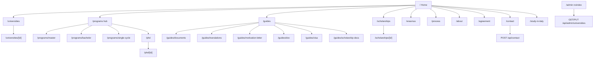

# KS Abroad Studies — Site map

Every public and internal URL currently implemented, grouped the way a visitor sees the menu.

**Header menu** (left → right): Universities · Master's · Bachelor's · Medicine · PhD · Guides · Scholarships · Erasmus · **Login / Register**  
**Always on screen:** Logo → `/` · Login + Register (or Portal when signed in) · WhatsApp float  
**Footer-only:** Contact, Process, About, Agreement, DOV, Visa



---

## 1. Header navigation

| # | Menu label | URL | Page purpose |
| --- | --- | --- | --- |
| — | Logo / name | `/` | Home: positioning, intake counts, shortcuts |
| 1 | Universities | `/universities` | Filterable list of Italian universities + admission status |
| 1a | *(from a card)* | `/universities/[id]` | One university: portal, fee, English/CGPA, programmes, apply links |
| 2 | Master's | `/programs/master` | English Laurea Magistrale explorer |
| 3 | Bachelor's | `/programs/bachelor` | English Laurea Triennale explorer + CEnT-S guide |
| 4 | Medicine | `/programs/single-cycle` | Medicine / dentistry / veterinary / pharmacy + IMAT |
| 5 | PhD | `/phd` | Dottorato A–Z + university explorer |
| 5a | *(from a card)* | `/phd/[id]` | One PhD school: portal type, programmes, requirements |
| 6 | Guides | `/guides` | Guide hub |
| 6a | Documents & attestation | `/guides/documents` | IBCC → HEC → MOFA / apostille chain |
| 6b | Translation companies | `/guides/translations` | Islamabad Embassy + Karachi Consulate lists |
| 6c | Motivation letter | `/guides/motivation-letter` | Structure, tips, mistakes |
| 6d | DOV & CIMEA | `/guides/dov` | Declaration of Value + CIMEA |
| 6e | Visa guide | `/guides/visa` | Islamabad + Karachi/BLS study visa |
| 6f | Scholarship documents | `/guides/scholarship-docs` | Per-region DSU + Pakistani LazioDisco steps |
| 7 | Scholarships | `/scholarships` | Regional DSU agencies |
| 7a | *(from a card)* | `/scholarships/[id]` | One region: benefits, documents, dates, agencies |
| 8 | Erasmus | `/erasmus` | Erasmus Mundus 2027 cycle |
| 9 | Contact | `/contact` | Form + WhatsApp + email |

Header also repeats **Contact Us** as a button (same `/contact`).

---

## 2. Home and extra public pages (not all in the header)

| URL | Linked from | Purpose |
| --- | --- | --- |
| `/` | Logo | Hero, counts from `universities.json`, deep links |
| `/study-in-italy` | Home / study cards | Overview of the Italy pathway with links into every major section |
| `/programs` | Process page, study-in-Italy | Programme-type hub (Master / Bachelor / Medicine / PhD) |
| `/process` | Footer | End-to-end process + CEnT-S and IMAT blocks |
| `/about` | Footer | SECP incorporation, CUIN, certificate PDFs |
| `/agreement` | Footer | Consultancy agreement + visa/liability disclaimers |

---

## 3. Guides tree (full)

```
/guides
├── /guides/documents
├── /guides/translations
├── /guides/motivation-letter
├── /guides/dov              ← also footer “DOV & CIMEA”
├── /guides/visa             ← also footer “Visa guide”
└── /guides/scholarship-docs
```

---

## 4. Dynamic URL parameters

| Pattern | Parameter | Source of IDs |
| --- | --- | --- |
| `/universities/[id]` | `id` e.g. `roma-tre`, `sapienza-university-of-rome` | `universities.json` → `universities[].id` |
| `/phd/[id]` | PhD university id | `phd.json` → `universities[].id` |
| `/scholarships/[id]` | Region id e.g. `lazio` | `regional-scholarships.json` → `regions[].id` |

Unknown ids → `notFound()`.

**Important:** `/universities/[id]` and `/phd/[id]` are **two catalogues**. A university can exist in admissions data, PhD data, both, or only one.

---

## 5. Internal / blocked from search

| URL | Who | robots |
| --- | --- | --- |
| `/admin` | Staff: seasonal university status editor | `Disallow: /admin`, `X-Robots-Tag: noindex` |
| `/portal`, `/login`, `/register` | Student account surfaces | Disallowed in `robots.ts`; portal also `noindex` via middleware |
| `/api/contact`, `/api/admin`, `/api/auth`, `/api/portal`, `/api/bot` | Private / write APIs | Disallowed |
| `/api/v1/*` (read) | Public catalogue API for apps + AI agents | **Allowed** (openapi, search, universities, programs) |

Middleware also returns **404** for `/.env*`, `/wp-admin`, `/wp-login`, `*phpmyadmin*`.

---

## 6. Static public files

| Path | Use |
| --- | --- |
| `/ks-abroad-logo.png` | Header / footer logo |
| `/company/*.pdf` | About downloads |
| `/manifest.webmanifest` | PWA |

---

## 6b. AI / SEO discoverability (complete)

| Surface | Implementation |
| --- | --- |
| `/sitemap.xml` | `src/app/sitemap.ts` — all static pages + universities + PhD + scholarships + AI surfaces |
| `/robots.txt` | `src/app/robots.ts` — allows public pages + AI bots; blocks private routes |
| `/llms.txt` | `src/app/llms.txt/route.ts` — short LLM index ([llmstxt.org](https://llmstxt.org/)) |
| `/llms-full.txt` | `src/app/llms-full.txt/route.ts` — full catalogue for AI crawlers |
| JSON-LD | Sitewide Organization + WebSite; FAQ on home; CollegeOrUniversity / scholarship / breadcrumbs on detail pages |
| Open Graph / Twitter | Root `layout.tsx` metadata + per-detail canonicals |
| Canonical base | `NEXT_PUBLIC_SITE_URL` (see `.env.example`) |

Helpers: `src/lib/seo.ts`, `src/lib/structured-data.ts`, `src/lib/llms.ts`, `src/components/json-ld.tsx`.

---

## 7. Off-site destinations (not site pages)

Opened in a new tab from cards, apply buttons, or footer:

| Destination | Typical trigger |
| --- | --- |
| University admission portals | University / programme apply links |
| `https://www.universitaly.it/` | Pre-enrolment |
| PICA `pica.cineca.it` | PhD applications |
| Regional DSU agency sites (e.g. laziodisco.it) | Scholarships |
| `https://wa.me/923131365614` | WhatsApp |
| `mailto:ksabroadstudies@gmail.com` | Email |
| Company + founder social URLs in `site.ts` | Footer / social component |

---

## 8. Crawl vs IA notes

- Primary IA is **header = 9 items**. Process / About / Agreement are secondary (footer).
- `/programs` is a hub; header skips it and deep-links to Master / Bachelor / Medicine.
- `/study-in-italy` is a narrative landing, not a header item.
- AI/SEO: `sitemap.ts`, `robots.ts`, `/llms.txt`, `/llms-full.txt`, and JSON-LD are implemented — set `NEXT_PUBLIC_SITE_URL` for production absolute URLs.
